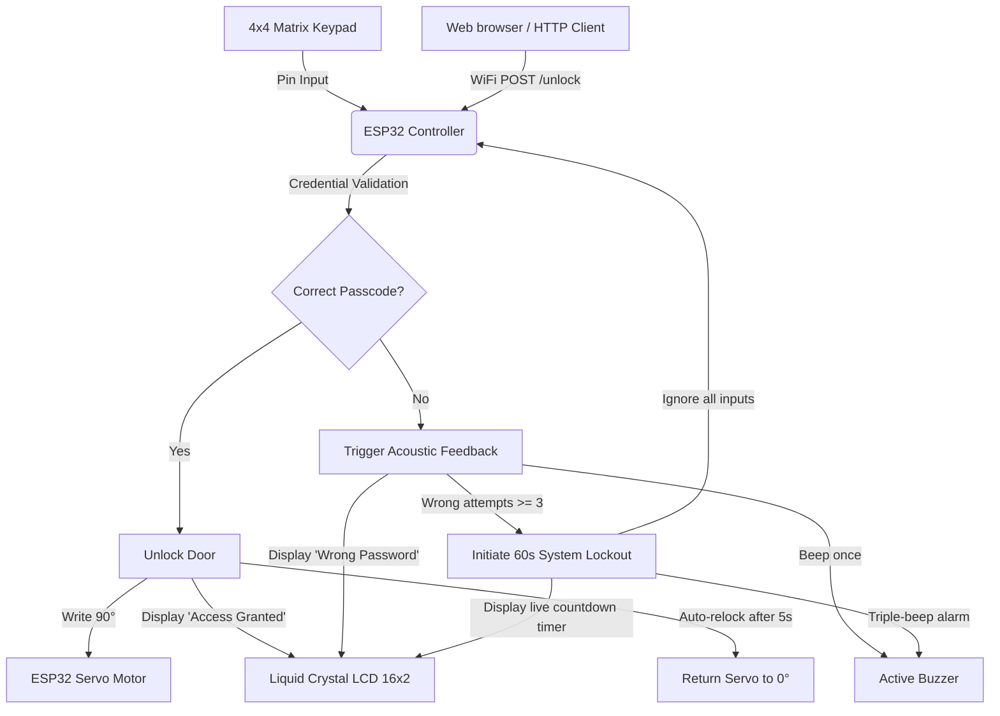

# 🔒 ESP32 Smart Door Lock System with Web & Keypad Authentication

An IoT-enabled smart door locking system powered by an **ESP32 microcontroller**, featuring dual-authentication (physical Keypad & Web Portal), real-time Liquid Crystal Display (LCD) feedback, acoustic alerts via a buzzer, and a security lockout system against brute-force attempts.

---

## 📐 System Architecture

The ESP32 serves as the central control unit, orchestrating inputs from the 4x4 matrix keypad and remote web requests, and outputting corresponding signals to the LCD display, buzzer, and servo motor.



---

## 🚀 Key Features

* **Dual Authentication Channels:**
  * **Keypad Control:** Enter the secret passcode locally using a physical 4x4 matrix keypad.
  * **Web Portal Control:** Unlock the door remotely by connecting to the ESP32's local web server via an elegant, responsive web page.
* **Brute-Force Lockout Security:**
  * Tracks consecutive failed attempts. Entering three wrong passwords triggers a hard **60-second system lockout**.
  * The system ignores all keypad and web requests during lockout, sounds a triple-beep alarm, and displays a **real-time live countdown timer** on the LCD.
* **Real-time Status Feedbacks:**
  * **Visual HUD:** A 16x2 LCD display provides real-time progress states (e.g., `"Connecting WiFi"`, `"WiFi Connected"`, `"Access Granted"`, `"Wrong Password"`, `"System Locked"`).
  * **Acoustic Indicators:** An active buzzer provides immediate auditory feedback for key presses, wrong passcodes, and lockout alerts.
* **Anti-Shoulder Surfing Masking:**
  * When typing on the physical keypad, inputs are masked with asterisks (`*`) on the LCD screen to prevent passcode exposure to bystanders.
* **Automatic Relocking Mechanism:**
  * Once unlocked, the high-torque servo motor rotates 90° to open the deadbolt, waits for **5 seconds**, and then automatically spins back to 0° to secure the door again.

---

## 🔌 Hardware Wiring & Pin Mapping

The system utilizes the ESP32's General Purpose Input/Output (GPIO) pins, keeping standard interfaces (I2C for LCD) and allocating digital lines for the keypad and actuators.

### 1. Actuators & Acoustics
| Component | ESP32 Pin | Mode | Description |
|:---|:---:|:---:|:---|
| **SG90 Servo Motor** | `GPIO 18` | PWM | Physical deadbolt lock actuator (0° locked, 90° unlocked) |
| **Active Buzzer** | `GPIO 19` | Output | Audio notification indicator |

### 2. Liquid Crystal Display (16x2 LCD with I2C Module)
| LCD Pin | ESP32 Pin | Description |
|:---|:---:|:---|
| **VCC** | `5V` | System Power |
| **GND** | `GND` | System Ground |
| **SDA** | `GPIO 21` | I2C Serial Data |
| **SCL** | `GPIO 22` | I2C Serial Clock |

### 3. 4x4 Matrix Keypad Configuration
| Row/Column | ESP32 Pin | Type |
|:---|:---:|:---|
| **Row 1** | `GPIO 32` | Input Pull-up |
| **Row 2** | `GPIO 33` | Input Pull-up |
| **Row 3** | `GPIO 25` | Input Pull-up |
| **Row 4** | `GPIO 26` | Input Pull-up |
| **Col 1** | `GPIO 27` | Output |
| **Col 2** | `GPIO 14` | Output |
| **Col 3** | `GPIO 12` | Output |
| **Col 4** | `GPIO 13` | Output |

---

## 🖥️ Web Portal Interface

When the ESP32 is powered on, it connects to your WiFi network and hosts a low-latency web server on port `80`. Accessing the ESP32's local IP address displays a beautiful, mobile-friendly landing page styled with a modern blue gradient:

* **Passcode Input:** A secure password input field masks input characters.
* **Submission:** Click **"Unlock Door"** to send the credential payload back to the ESP32 via HTTP POST.

---

## 🛠️ Software Installation & Setup

### 1. Prerequisite Libraries
Open the **Library Manager** in the Arduino IDE (`Ctrl + Shift + I` or `Cmd + Shift + I`) and install:
1. `LiquidCrystal_I2C` by Frank de Brabander
2. `Keypad` by Mark Stanley, Alexander Brevig
3. `ESP32Servo` by Kevin Harrington

### 2. Flashing the Controller
1. Open the [ES_SMART_DOOR.ino](file:///c:/Users/parth/OneDrive/Desktop/Smart_Lock/ES_SMART_DOOR.ino) sketch in Arduino IDE.
2. Navigate to the top and modify your network credentials:
   ```cpp
   const char* ssid = "YOUR_WIFI_SSID";
   const char* password = "YOUR_WIFI_PASSWORD";
   ```
3. Set your custom default passcode (must be 4 characters long):
   ```cpp
   String correctPassword = "5678";
   ```
4. Connect your ESP32 board to your PC via a Micro-USB or USB-C cable.
5. In Arduino IDE, go to **Tools -> Board** and select **ESP32 Dev Module**.
6. Select your active COM port under **Tools -> Port**.
7. Click **Upload** (`Ctrl + U`). Open the **Serial Monitor** at `115200` baud rate to view system logs and capture the assigned local IP address!

---

## 📂 Git Repository Structure

```text
Smart_Lock/
├── ES_SMART_DOOR.ino       # Core Arduino/C++ source code for ESP32
├── ES_PROJECT (1) (1).pdf  # Full project report and hardware schematics
├── Smart door lock.mp4     # Video demonstration of the working project
├── README.md               # Visual system documentation
└── .gitignore              # Standard Arduino build output ignores
```
